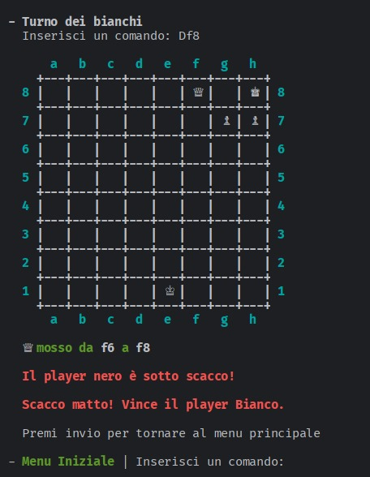

# Chess python
Chess in python (University Project, Ingegneria Del Software)

# 🕹 Game

Chess game in python, commands/movements are inserted via terminal, all movements must adhere to chess Algebraic Notation rules.

- Detailed Report in Italian: [here](https://github.com/Hue-Jhan/Chess-python/blob/main/docs/Report.md)
- Detailed Game Manual: [here](https://github.com/Hue-Jhan/Chess-python/blob/main/docs/Manuale.md)
- Other doc files: [here](https://github.com/Hue-Jhan/Chess-python/tree/main/docs)

The git pipelines are disabled so the docker build has (obviously) failed, i left the CI/CI-CD pipelines as well as the Dockerfile in case someone wants to use them anyways.

# 🕷 Errori (Italian) 

Ecco le correzioni dello Sprint 2 (punteggio base 19/30):

Errori **Major** (gravi, 1 punto in meno ciascuno):
- Test Continuous integration non attivo, a lezione è stato detto di attivarlo prima dell'inizio dello Sprint 2;
- Modello di dominio con una composizione dal lato sbagliato e un'altra senza senso oltre a esserci Menu che non è un concetto del gioco;
- Nel diagramma dei package ci sono dipendenze da user_interfaces a core e engine non presenti nel codice +  dipendenze da rich o da core verso numpy non documentate;

Errori *minor* (lievi, 1/3 di punto in meno ciascuno):
- Presenza di requisito non funzionale espresso in modo non verificabile (RNF4);
- Nel system design si fa riferimento a componenti che in realtà sono classi interne ai file, andavano modellate componenti esterne;
- UIManager è un'interfaccia ma in realtà non è una classe astratta;
- Diagrammi delle classi con direzioni delle associazioni e segni di composizione dal lato sbagliato;
- Diagrammi di sequenza con barre di attivazione che non finiscono quando dovrebbero e quindi hanno più messaggi in ingresso;
- Classe Match non ha istruzioni di print dirette ma passa degli argomenti che non separano nettamente la presentazione a causa dei caratteri di controllo.

Note aggiuntive (lievi, 1/3 di punto in più ciascuna):
- descrizione accurata dell'organizzazione del lavoro.

  
