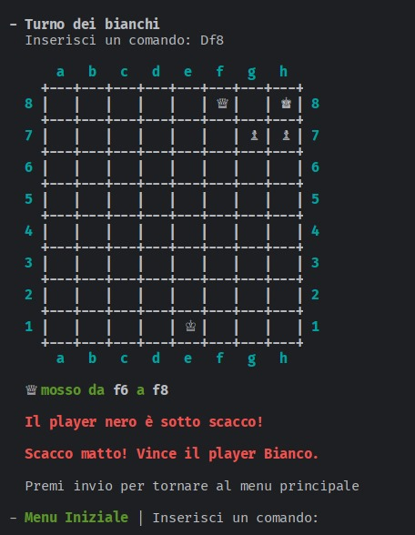

# Manuale Utente

### Comandi menù iniziale 

All' apertura dell'applicazione l'utente potrà inserire i seguenti comandi:
- /gioca: permetterà all'utente di generare una nuova partita di gioco, se la partita venisse già avviata allora l'applicazione andrà a definire il turno del giocatore che dovrà compiere la mossa;
- /help oppure --help o -h: per poter visualizzare i comandi disponibili con una breve descrizione su ciascuna;
- /esci: quando attivato il sistema chiederà una conferma: se affermativa allora l'applicazione si chiuderà e il controllo ritornerà al sistema operativo; se rifiutata allora l'applicazione attenderà nuovi comandi.

### Partita
Una volta che l'utente creerà una partita comparirà a schermo la scacchiera con tutti i pezzi, e all'inizio di ogni partita inizierà il giocatore con le pedine bianche (in relazione con il regolamento ufficiale degli scacchi).
Successivamente, a turno, i due giocatori potranno sfidarsi, fino al momento in cui: si verifica uno stallo, o uno dei due giocatori vince la partita, vorrà abbandonare, proporre una patta, o uscire dal gioco. In tutti i casi tranne l'uscita dal gioco si ritornerà al menu principale, nel caso d'uscita, come detto in precedenza, l'applicazione viene chiusa totalmente.

#### Comandi partita
I seguenti comandi potranno essere utilizzatti dai due utenti durante il gioco: 

- /scacchiera: per mostrare la posizione dei pezzi presenti sulla scacchiera, può essere richiamato ad ogni turno per visualizzare a schermo la scacchiera con le posizioni aggiornate. Questo comando potrà essere utilizzato durante la partita, e se eseguita nel menù principale l'applicazione suggerirà di utilizzare per primo il comando gioca;
- /abbandona: se l'intenzione di uno dei due giocatori fosse quella di abbandonare la gara allora lo stesso dovrà usare il comando apposito, in questo modo l'applicazione chiederà una risposta per confermare la richiesta: se venisse confermata allora l'applicazione comunicherà che l'avversario ha vinto per abbandono, mentre se venisse negata allora l'applicazione si predisporrà a ricevere nuovi tentativi o comandi;
- /patta: con questo comando uno dei due giocatori richiederà di voler concludere la partita con un pareggio, e per confermarla sarà necessaria la risposta affermativa dell'avversario. Se l'avversario non volesse concludere allora negherà la conferma; in questo modo l'applicazione si predisporrà a ricevere nuovi tentativi o comandi;
- /mosse: consente all'utente di mostrare le mosse effettuate con notazione algebrica, e le stesse riguardano solo la partita che si sta conducendo in quel momento. L'utente, per poter effettuare le mosse durante la partita, dovrà inserire due coppie di valori numero-carattere (esempio: e4, d5,...) 
per definire la posizione della pedina che si vuole muovere e della posizione in cui si vorrà piazzare la stessa (l'applicazione confermerà al momento se la mossa che si vuole avviare può essere completata oppure no: se l'esito fosse positivo allora l'applicazione mostrerà la scacchiera con le posizioni delle pedine aggiornate; se l'esito fosse negativo allora l'applicazione mostrerà un messaggio d'errore rimanendo in attesa di una mossa valida).
- /help: per conoscere nuovamente l'elenco dei comandi utilizzabili (vedi sezione Comandi menu iniziale);
- /esci: per poter uscire dall'applicazione durante la partita (vedi sezione Comandi menu iniziale);

#### Pedine, movimento, cattura e scacco
Ogni movimento inserito deve essere in Notazione algebrica, è fortemente consigliato agli utenti inesperti di leggere [questa guida](https://it.m.wikipedia.org/wiki/Notazione_algebrica) prima di iniziare. 

Ecco i tipi di movimenti possibili dalle varie pedine: 

- Pedone: i pedoni possono compiere il movimento e la cattura in due modi diversi: si muovono in avanti, ma catturano in diagonale. I pedoni possono solo avanzare e di una sola casella per volta, ad eccezione della prima volta dove può avanzare anche di due caselle. I pedoni catturano solo sulle caselle poste immediatamente davanti a loro, in diagonale. Non possono mai indietreggiare, né catturare all'indietro. Se un altro pezzo è collocato direttamente davanti al pedone quest'ultimo non può né superarlo né catturarlo. Per il pedone si considera un'importante implementazione, conosciuta come "promozione del pedone":
    - Se un pedone riesce ad avanzare fino all'ottava traversa, viene promosso, ossia assume il ruolo e le capacità di movimento di un altro pezzo dello stesso colore (donna, torre, alfiere o cavallo) a seconda di cosa ha specificato il giocatore in notazione algebrica, se non viene specificato nessun pezzo, il pedone viene promosso automaticamente a Regina. In questo modo è dunque possibile avere un numero di esemplari di un certo pezzo maggiore rispetto a quello iniziale. 
- Regina: potrà muoversi nelle caselle che sono poste in orizzontale, verticale e diagonale; la cattura avviene nelle stesse posizioni in cui avviene il movimento;
- Torre: potrà muoversi nelle caselle che sono poste in orizzontale e in verticale; la cattura avviene nelle stesse posizioni in cui avviene il movimento;
- Alfiere: potrà muoversi nelle caselle che sono poste in diagonale; la cattura avviene nelle stesse posizioni in cui avviene il movimento;
- Cavallo: il suo movimento, a differenza delle altre pedine, segue l'andamento a "L", ovvero due caselle in una direzione (orizzontale e verticale) e poi una caselle perpendicolarmente a quella direzione. La sua cattura può avvenire nelle posizioni in cui il cavallo potrà posizionarsi nuovamente all'interno della scacchiera;
- Re: il movimento del Re può avvenire nelle caselle immediatamente vicino ad esso. Essendo la pedina più importante del gioco prestare attenzione ai seguenti punti:
    - non può muoversi in posizioni che sono minacciate dalle pedine avversarie, per vedere come procedere in situazioni simili si può leggere la sezione "Effettuare scacco e scacco matto";
    - può effettuare le catture nelle stesse posizioni in cui può effettuare il movimento;
    - una sola volta in tutta la partita ciascun re può usufruire di una mossa speciale, nota come arrocco, che consiste nel muovere il re di due case in direzione della torre lato re (arrocco corto) o della torre lato donna (arrocco lungo) e successivamente, sempre durante lo stesso turno, muovere la torre verso la quale il re si è mosso nella casa compresa tra quelle di partenza e di arrivo del re. Questo si può fare solamente se tutte le condizioni seguenti sono soddisfatte: Il giocatore non ha ancora mosso né il re né la torre coinvolta nell'arrocco; non ci devono essere pezzi (amici o avversari) fra il re e la torre utilizzata; né la casa di partenza del re, né la casa che esso deve attraversare, né quella di arrivo devono essere minacciate da un pezzo avversario. Per poter essere effettuato nell' app l'utente dovrà inserire i seguenti comandi: 0-0 per l'arrocco corto, 0-0-0 per l'arrocco lungo.

#### Effettuare scacco e scacco matto

Per poter effettuare lo scacco al Re e lo scacco matto gli utenti devono seguire le seguenti istruzioni:
- Il re è l'unico pezzo che non può mai essere catturato, ma solo minacciato. Quando è minacciato, ovvero è sulla traiettoria di un pezzo nemico, si dice che è "sotto scacco", questa condizione viene comunicata tramite un messaggio, e nell'elenco mosse viene aggiunto il simbolo "+" alla mossa che porta il re avversario sotto scacco, seguendo le regole della notazione algebrica; non è consentita alcuna mossa che ponga o lasci il proprio re in condizione di scacco, per eliminare la minaccia si deve procedere in uno dei seguenti modi:
    - muovere il re in una delle case adiacenti, a patto che questa non sia sotto il controllo di un pezzo avversario; 
    - catturare, con il re o con un altro pezzo, il pezzo avversario che si trova sulla traiettoria del re e dà origine allo scacco; 
    - nel caso di minaccia da parte di donna, torre o alfiere non adiacenti al re sotto attacco, frapporre tra quest'ultimo e il pezzo che minaccia scacco un qualunque pezzo o pedone, in modo che sia quest'ultimo a essere minacciato invece del re. 
    - Se nessuna delle mosse che il giocatore può effettuare è in grado di liberare il re dallo scacco, si tratta di scacco matto e la partita termina con la vittoria dell'avversario;
    - Se invece il re non si trova sotto scacco ma non è possibile effettuare alcuna mossa legale (ad esempio se si ha solo il re in gioco ed esso non è sotto scacco ma tutte le case ad esso adiacenti sono minacciate), si tratta di stallo e la partita termina con un risultato di parità, non potendo il giocatore che si trova in questa condizione muovere senza contravvenire alle regole del gioco.
    - Nel momento in cui si raggiunge una condizione di fine partita viene mostrato un messaggio, nel caso di scacco matto si riporta il colore del vincitore, nel caso di stallo viene mostrato un semplice messaggio di parità. Dopo ciò l'utente non potrà usare i comandi principali ma dovrà premere il pulsante invio per ritornare al menu principale, dove potrà utilizzare nuovamente i comandi per esempio per iniziare una nuova partita o uscire dal gioco.