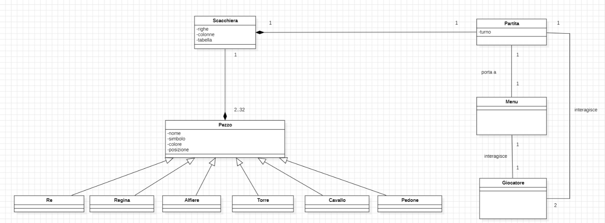
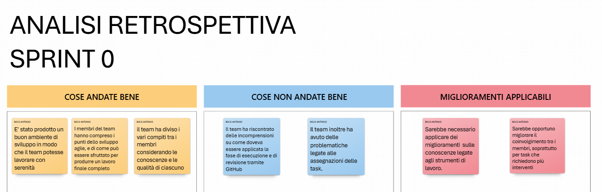
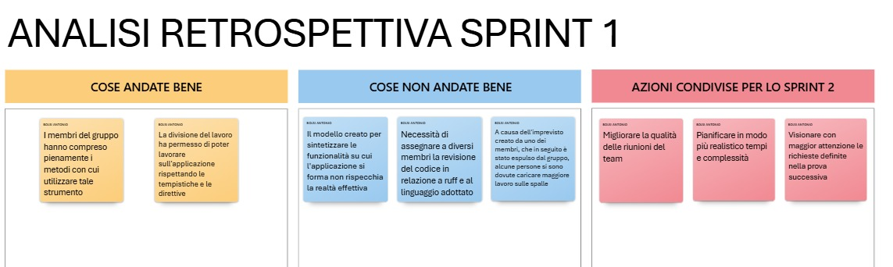

# Relazione Tecnica


  ---

# 1) Introduzione  
Gli scacchi sono un gioco di strategia che si svolge su una tavola quadrata detta scacchiera, formata da 64 caselle di due colori alternati, sulla quale ogni giocatore 
dispone di 16 pezzi (bianchi o neri a seconda della scelta): un re, una donna, due alfieri, due cavalli, due torri e otto pedoni; ogni casella può essere occupata da un solo pezzo, 
che può catturare o "mangiare" il pezzo avversario andando a occuparne la casella; obiettivo del gioco è dare scacco matto, ovvero minacciare la cattura del re avversario in modo tale 
che l'altro giocatore non possa eseguire mosse legali.


---

# 2) Modello di dominio 




---

######  ⬇  clicca il titolo per visualizzare la sezione

<details style="margin-bottom: 2px;" > 
  <summary><h1> 3) Requisiti specifici e Casi d'uso...  </h1>
  
  </summary>
  
  
  <p align="left">


### 3.1) Requisiti funzionali
- RF1: Il sistema deve consentire a due giocatori di iniziare una nuova partita;
- RF2: Il sistema deve permettere il movimento dei pezzi secondo le regole standard degli scacchi;
- RF3: Il sistema deve rilevare situazioni di scacco, scacco matto e stallo;
- RF4: Il sistema deve impedire mosse illegali, come muovere un pezzo dell'avversario o muovere un pezzo che lascia il re sotto scacco;
- RF5: Il sistema deve tenere traccia della cronologia delle mosse;
- RF6: Il sistema deve consentire ai due giocatori la possibilità di concludere la partita con un pareggio;      
- RF7: Il sistema deve consentire l'abbandono di una partita da parte di uno dei due giocatori.

### 3.2) Requsiti non funzionali
- RNF1: Il sistema deve rispondere alle azioni dell’utente in meno di 1 secondo;
- RNF2: Il sistema deve mettere a disposizione un metodo per definire ciò che l'utente può fare e non;
- RNF3: L'utente deve agire sul programma tramite i comandi da tastiera;
- RNF4: Il sistema deve essere compatibile con diversi sistemi operativi.


### 3.3) Casi d'uso

#### UC1 – Creazione nuova partita
- **Attori principali**: Giocatore
- **Descrizione**: Un giocatore avvia una nuova sessione di gioco.
- **Precondizioni**: L’applicazione è avviata.
- **Flusso principale**:
  - Il giocatore seleziona il comando "/gioca".
  - Il sistema inizializza la scacchiera e fa incominciare la partita ai bianchi.
- **Postcondizioni**: Viene mostrata la scacchiera e inizia la partita.

#### UC2 – Muovere un pedone
- **Attori principali**: Giocatore
- **Descrizione**: Un giocatore seleziona un pedone e lo muove secondo le regole degli scacchi.
- **Precondizioni**: È il turno del giocatore e il pedone può essere mosso legalmente.
- **Flusso principale**:
  - Il giocatore inserisce il comando di movimento (es. `a2 a4`).
  - Il sistema verifica la legalità della mossa.
  - Il pedone viene mosso e la mossa viene salvata nella cronologia.
- **Postcondizioni**: il sistema mostrerà a schermo la scacchiera aggiornata.

#### UC3 – Abbandonare la partita
- **Attori principali**: Giocatore 1(bianchi), Giocatore 2(neri)
- **Descrizione**: Un giocatore abbandona la partita lasciando la vittoria all'avversario.
- **Precondizioni**: Partita in corso.
- **Flusso principale**:
  - Il giocatore 1 inserisce il comando `/abbandona`.
  - Il sistema richiede una conferma
  - Se accettata il sistema dichiara il secondo giocatore vincitore.
- **Postcondizioni**: La partita termina con la vittoria per il giocatore 2

#### UC4 – Richiedere patta
- **Attori principali**: Giocatore 1 (bianchi), Giocatore 2 (neri)
- **Descrizione**: Un giocatore propone una patta all'avversario che, se accettata da quest'ultimo, termina la partita in pareggio.
- **Precondizioni**: Partita in corso.
- **Flusso principale**:
  - Il primo giocatore inserisce il comando `/patta`.
  - Il sistema richiede una conferma al secondo giocatore
  - Se confermata la partita termina in pareggio.
- **Postcondizioni**: La partita si conclude senza vincitori.

#### UC5 – Visualizzare help ed elenco comandi
- **Attori principali**: Giocatore
- **Descrizione**: Il giocatore richiede l’elenco dei comandi disponibili.
- **Flusso principale**:
  - Il giocatore inserisce il comando '/help' o invocando l'app con flag --help o -h
  - Il sistema mostra l’elenco dei comandi disponibili e una breve descrizione.
- **Postcondizioni**: Nessuna modifica allo stato della partita.

#### UC6 – Uscita dall’applicazione
- **Attori principali**: Giocatore
- **Descrizione**: Il giocatore termina l'esecuzione dell'applicazione.
- **Precondizioni**: Nessuna.
- **Flusso principale**:
  - Il giocatore inserisce il comando `/esci`.
  - Il sistema richiede un ulteriore conferma
  - Se confermata il sistema chiude l'applicazione.
- **Postcondizioni**: Il programma termina.

#### UC7 – Visualizzare cronologia mosse
- **Attori principali**: Giocatore
- **Descrizione**: Il giocatore può consultare, durante la partita, l’elenco delle mosse effettuate fino a quel momento.
- **Flusso principale**:
  - Il giocatore inserisce il comando `/mosse`.
  - Il sistema stampa l’elenco ordinato delle mosse effettuate.
- **Postcondizioni**: Nessuna modifica allo stato della partita.

#### UC8 – Visualizzare scacchiera aggiornata con i pezzi
- **Attori principali**: Giocatore
- **Descrizione**: Il giocatore può, durante la partita, vedere la scacchiera con le posizione delle pedine fino a quel momento
- **Flusso principale**:
  - Il giocatore inserisce il comando `/scacchiera`.
  - Il sistema mosterà a schermo la scacchiera con le posizioni delle pedine mantenute fino alla mossa più recente.
- **Postcondizioni**: Nessuna modifica allo stato della partita.

#### UC9 - Muovere Pedone Con Cattura
- **Attori principali**: Giocatore (bianchi o neri)
- **Descrizione**: un giocatore effettua una mossa con uno dei suoi pedoni e cattura una pedina dell'avversario
- **Precondizione**: la mossa del giocatore deve essere effettuata in modo tale che il pedone che muove possa catturare una pedina avversaria posizionata su una delle due diagonali anteriori 
- **Flusso Principale**:
  - Il giocatore muove la pedina su una delle diagonali anteriori;
  - Cattura la pedina avversaria;
  - Il sistema notifica la cattura all'avversario;
  - Il turno successivo verrà assegnato all'avversario
- **Postcondizione**: L'avversario potrà effettuare una nuova mossa con una pedina in meno giocabile

#### UC10 - Muovere La Donna
- **Attori principali**: Giocatore (bianchi o neri)
- **Descrizione**:  Un giocatore muove la donna tra i pezzi della scacchiera
- **Precondizione**: La donna deve essere presente come pedina giocabile
- **Flusso Principale**:
   - Il giocatore decide di muovere la regina;
   - inserisce la regina su una nuova posizione 
- **Postcondizione**: La scacchiera sarà aggiornata con la nuova posizione e il turno passerà all'avversario

#### UC11 - MUOVERE UNA TORRE
- **Attori principali**: Giocatore (bianchi o neri)
- **Descrizione**: Un giocatore muove una torre tra i pezzi della scacchiera
- **Precondizione**: una delle due torri deve essere presente come pedina giocabile
- **Flusso Principale**:
   - Il giocatore decide di muovere la torre;
   - inserisce la torre su una nuova posizione 
- **Postcondizione**: La scacchiera sarà aggiornata con la nuova posizione e il turno passerà all'avversario

#### UC12 - MUOVERE UN'ALFIERE
- **Attori principali**: Giocatore (bianchi o neri)
- **Descrizione**:  Un giocatore muove un'alfiere tra i pezzi della scacchiera
- **Precondizione**: uno dei due alfieri deve essere presente come pedina giocabile
- **Flusso Principale**:
  - Il giocatore decide di muovere l'alfiere;
  - inserisce l'alfiere su una nuova posizione 
- **Postcondizione**: La scacchiera sarà aggiornata con la nuova posizione e il turno passerà all'avversario

#### UC13 - MUOVERE UN CAVALLO
- **Attori principali**: Giocatore (bianchi o neri)
- **Descrizione**: Un giocatore muove un cavallo tra i pezzi della scacchiera
- **Precondizione**: uno dei due cavalli deve essere presente come pedina giocabile
- **Flusso Principale**:
  - Il giocatore decide di muovere il cavallo;
  - inserisce il cavallo su una nuova posizione 
- **Postcondizione**: La scacchiera sarà aggiornata con la nuova posizione e il turno passerà all'avversario

#### UC14 - MUOVERE IL RE SENZA ARROCCO
- **Attori principali**: Giocatore (bianchi o neri)
- **Descrizione**: Un giocatore muove il re tra i pezzi della scacchiera
- **Precondizione**: Il re deve muoversi in una posizione senza che questa sia minacciate dalle pedine avversarie
- **Flusso Principale**:
  - Il giocatore decide di muovere il re;
  - inserisce il re su una nuova posizione;
  - Il sistema conferma che la nuova posizione è accettata (non minacciata) 
- **Postcondizione**: La scacchiera sarà aggiornata con la nuova posizione e il turno passerà all'avversario

#### UC15 - GIOCARE ARROCCO
- **Attori principali**: Giocatore (bianchi o neri)
- **Descrizione**: Un giocatore muove il re e una delle due torri tra i pezzi della scacchiera
- **Precondizione**:
  - Il giocatore non ha ancora mosso né il re né la torre coinvolta nell'arrocco; 
  - Non ci devono essere pezzi (amici o avversari) fra il re e la torre utilizzata; 
  - Né la casa di partenza del re, né la casa che esso deve attraversare, né quella di arrivo devono essere minacciate da un pezzo avversario. 
- **Flusso Principale**:
  - Il giocatore decide che tipologia di arrocco vuole applicare (lungo o corto);
  - inserisce il re e una delle due torri in nuove posizioni
  - Il sistema conferma che le nuove posizioni rispettano la logica dell'arrocco 
- **Postcondizione**: La scacchiera sarà aggiornata con le nuovi posizioni e il turno passerà all'avversario

#### UC16 - PROMUOVERE UN PEDONE
- **Attori principali**:Giocatore (bianchi o neri)
- **Descrizione**: un giocatore posiziona un pedone nell'ottava traversa e attiva la promozione
- **Precondizione**: la pedina arriva alla settima traversa senza subire minacce
- **Flusso Principale**:
  - Il giocatore muove la pedina nell'ottava traversa;
  - Il sistema riconosce la possibilità di promozione e chiede al giocatore la nuova pedina;
  - Il giocatore sceglie una tra le possibili scelte (Donna, Alfiere, Cavallo o Torre)
- **Postcondizione**: La scacchiera sarà aggiornata con nuove pedine e il turno passerà all'avversario

#### UC17 - Scacco Matto
- **Attori principali**: Giocatore 1(bianchi), Giocatore 2 (neri)
- **Descrizione**Un giocatore effettua una mossa attivando lo scacco matto, concludendo la partita con la propria 
vittoria
- **Precondizione**: Il giocatore che effettua la mossa deve disporre i propri pezzi in modo tale da:
	- Mettere il re avversario sotto scacco;
	- Impedire che il re possa sfuggire (nessuna mossa possibile lo libera dallo scacco)
- **Flusso Principale**:
	- La partita è in corso;
	- Il Giocatore 1 esegue una mossa che pone il re avversario sotto scacco;
	- Il sistema verifica che il re del Giocatore 2 non ha alcuna mossa legale per uscire dallo scacco;
	- Il sistema dichiara lo scacco matto;
	- Il sistema assegna la vittoria al Giocatore 1 che ha effettuato la mossa vincente;
- **Postcondizione**: Il sistema stamperà un messaggio che indica la conclusione della partita e il giocatore vincente e riporterà il menù principale a schermo.

.
  </p>
  
</details>

---

# 4) System Design 

### 4.1) Diagramma delle componenti

Il sistema è costituito da tre componenti principali:
- UserInterfaceComponent: fornisce i servizi per la gestione dell’interazione con l’utente, tra cui l’inserimento dei comandi e la visualizzazione dell’output;
- GameEngineComponent: coordina il flusso di gioco, gestisce il menu e avvia la logica del gioco tramite un’interfaccia verso il core;
- GameCoreComponent: fornisce la logica principale del gioco, la gestione della board e dei pezzi, e le regole fondamentali.

Queste componenti comunicano tra loro tramite le interfacce definite:
- UIManager: consente a GameEngineComponent di accedere ai servizi offerti da UserInterfaceComponent;
- GameLauncher: consente a GameEngineComponent di inizializzare e controllare la logica offerta da GameCoreComponent.

Inoltre il sistema è composto dalle seguenti componenti esterne:
- numpy: utilizzato nella componente GameCoreComponent per operazioni matriciali e gestione della board di gioco;
- abc: utilizzato per la definizione di classi astratte e metodi astratti, al fine di implementare correttamente il polimorfismo;
- rich: utilizzato in UserInterfaceComponent per formattare e stampare output in modo più leggibile e visivamente chiaro.


### 4.2) Diagramma dei package
Tra i vari package che compongono il progetto sono state definite delle dipendenze tramite il collegamento con una freccetta tratteggiata. Questo permette di definire le relazioni in cui è richiesto l'accesso verso un altro package in modo tale che il package
che lo richiede potrà funzionare correttamente.


### 4.3) Commento delle decisioni prese in relazione ai requisiti non funzionali e ai principi di progettazione
E' possibile dimostrare che lo sviluppo del programma è avvenuto rispettando questi requisiti non funzionali:
- RNF1: le risposte del sistema sono progettate per essere immediate e ottimizzate, grazie a una gestione efficiente del flusso di input/output e a una struttura modulare del codice. In fase di test, si è verificato che tutte le azioni dell’utente ricevono risposta entro un tempo inferiore al secondo;
- RNF2, tramite il comando /help invocabile dall'utente viene attivato l'user interface e, tramite la chiamata a getcommands, viene stampato a schermo tutti i comandi eseguibili;
- RNF3: Il programma è completamente operabile tramite tastiera attraverso un’interfaccia a riga di comando (CLI), che rappresenta il principale punto di interazione con l’utente;
- RNF4: L’utilizzo di Docker come ambiente di esecuzione permette di garantire la compatibilità del programma su diversi sistemi operativi come Windows e Linux, dimostrando la corretta esecuzione in entrambi i casi, a conferma della portabilità del software.

  
Inoltre i diagrammi definiti sono stati creati per poter rispettare il seguente principio di progettazione:
- Presentazione separata, è stato mantenuto un chiaro isolamento tra la logica del dominio e l’interfaccia utente. Questo consente di modificare o sostituire il meccanismo di input/output senza impattare sul core del sistema, migliorando la manutenibilità e la riusabilità del codice.


---


###### ⬇ clicca il titolo per visualizzare la sezione ⬇

<details style="margin-bottom: 2px;" > 
  <summary><h1> 5) Object Oriented Design  </h1> 
  </summary>
  
  
  <p align="left">

### 5.1) Diagramma delle classi e diagramma delle sequenze per le user story più importanti

Nei seguenti diagrammi delle classi si è preferito rappresentare solo i metodi principali rilevanti per le user story, tralasciando quelli ausiliari per motivi di chiarezza; questo permetterà una lettura dei diagrammi più semplificata. E su ciascuna sezione sono riportate le motivazioni per cui il team ha scelto di creare i diagrammi delle classi e di sequenza per quelle determinate user story

#### Creazione partita
Questa user story è stata selezionata per l’analisi approfondita perché rappresenta l’inizializzazione dell’intero ciclo di gioco, coinvolge oggetti fondamentali (scacchiera, pezzi, giocatori, partita), e ha un alto impatto sistemico. Essa è fortemente connessa con molte altre user story (muovi pedina, abbandona partita, esci dalla partita ecc.), rendendola un punto di partenza ideale per il disegno del diagramma delle classi e di sequenza

##### - Diagramma delle classi: 
  


##### - Diagramma di sequenza: 
  


#### Muovere un pedone
La seguente user story è stata selezionata perché rappresenta l’azione centrale del gioco: muovere un pezzo sulla scacchiera. Risulta essenziale poiché da essa possono partire le altre logiche legate al gioco (come il movimento delle altre pedine, la cattura, lo scacco e scacco matto).
Modellare questa funzionalità permette di chiarire le responsabilità delle classi che coinvolgono il gioco (come Pedone, Re, Scacchiera, Partita e Turno), la comunicazione tra giocatore e sistema, e la verifica delle regole scacchistiche

##### - Diagramma delle classi:


##### - Diagramma di sequenza:


#### Abbandona partita
La possibilità di abbandonare una partita è un'azione frequente e necessaria per garantire libertà all’utente, soprattutto in situazioni in cui non è in grado di continuare la partita in corso. 
Inoltre l’azione di abbandono è legata a casi d’uso successivi o paralleli come ‘patta’ oppure ‘esci dalla partita’, quindi funge da caso di riferimento per sviluppi futuri

##### - Diagramma delle classi:


##### - Diagramma di sequenza:


#### Effettuare uno Scacco matto
E' stata scelta questa user story perché rappresenta l’evento finale e cruciale dell’intera sessione di gioco. Lo scacco matto modifica radicalmente lo stato del sistema, richiede una valutazione complessa della posizione e delle possibili mosse del re, e comporta azioni automatiche da parte del sistema, come la dichiarazione del vincitore, il blocco della scacchiera e il messaggio di fine partita.
Dal punto di vista architetturale modellare questa funzionalità permette di analizzare le interazioni più complesse che si instaurano tra le varie classi del programma oltre a visualizzare come il flusso di gioco si conclude nel programma

##### - Diagramma delle classi:


##### - Diagramma di sequenza:


### 5.2) Decisioni riguardanti la progettazione

Le decisioni sono state prese per soddisfare il seguente principio legato all'O.O. design:
- Presentazione separata: esso permette di suddividere il programma in sezioni specifiche del codice, in particolare esso
  dispone di un package in cui è conservata l'interfaccia grafica (utile per il ricevimento dei comandi e la comunicazione con l'utente), un package per tutto ciò che riguarda le funzioni della partita e un package dove sono conservate tutte le classi delle pedine e tutto ciò che riguarda la scacchiera (come l'inizializzazione e l'aggiornamento durante la partita); 

.

  </p>
  
</details>

---

# 6) Riepilogo dei Test

Dato che il progetto è suddiviso in più pacchetti (core, engine, user_interfaces, ecc.), i test sono stati organizzati per verificare il corretto funzionamento di queste componenti in modo modulare e integrato.

### 6.1) Criterio di selezione dei casi di test:
- Ogni classe pubblica e funzione con logica è stata considerata come candidato per i test unitari.

- I test di integrazione sono stati sviluppati per verificare il corretto flusso tra componenti di pacchetti diversi (es. tra input utente e logica di comando).

- I casi limite (input non validi, stati di errore) sono stati inclusi per aumentare la copertura dei test.

### 6.2) Localizzazione dei test:
I test si trovano nella directory /tests e sono strutturati nelle seguenti sottocartelle:

- ```test_engine/``` → test per commands.py, match.py, menu.py
- ```test_core/``` → test per board.py e pawns.py
- ```test_main.py``` → test per l’avvio e il flusso principale del programma

### 6.3) Tipologie di test:
#### - Test di unità (pytest):
- Verificano singoli metodi e funzioni e coprono controlli di risposte corrette a comandi, gestione degli errori, e istanziazioni di classi;
- File: ```test_main.py```, ```tests_core/test_pawns.py```, ```tests_engine/test_match.py```.
- Descrizione: Test per l'istanziazione corretta della classe Match e di tutte le varie pedine; per la creazione di una partita; per alcuni funzionamenti di sistema come il passaggio del parametro "help" come argomento del main, per la quale abbiamo usato una componente interna di Pytest chiamata "Monkeypatch", e test per il funzionamento corretto dei metodi delle classi citate in precedenza; Del file ```test_match.py``` va considerata solo la prima funzione, in quanto le successive riguardano la logica della partita e vengono descritte nella sezione successiva.
- Numero: 3 in test_main, 5 in test_pawns e 1 in test_match.

#### - Test di integrazione:
- Testano il corretto funzionamento combinato di più componenti e il flusso di comando/risposta tra interfaccia utente, logica di gioco e rappresentazione della scacchiera;
- File e : ```tests_core/test_board.py```:, ```tests_engine/test_commands.py```, ```tests_engine/test_menu.py```, ```tests_engine/test_match.py```.
- Descrizione: Test per i vari comandi inseribili dall'utente e quindi tutte le User story, comprendendo casi come comandi non riconosciuti o ritorno al menu principale; test complessi per il funzionamento dei movimenti delle pedine e mosse speciali, concentrandosi in particolare sul funzionamento interno di ogni funzione necessaria alle user story in questione e di come interagiscono con il resto del codice; test sulla logica della partita comprendendo casi di Fine partita, per fare ciò vengono simulate le scacchiere e effettuate delle mosse per calcolare i casi di scacco, scacco matto e stallo; Per effettuare questi test in alcuni casi sono state create delle classi apposite ed è stata utilizzata, come citato in precedenza, la componente "Monkeypatch" di pytest. 
- Numero: 23 in board, 7 in test_commands, 7 in test_menu, e 2 in test_match.

#### - Test di sistema e Test di Accettazione:
Testati manualmente per verificare il funzionamento globale del sistema.
- Descrizione: abbiamo testato ogni condizione di fine partita manualmente, per accellerare il processo abbiamo modificato temporaneamente la scacchiera in modo tale da avere alcune pedine già in posizioni utili al test all'inizio di ogni partita. Questi test hanno coinvolto il caso di scacco matto per ciascun Giocatore, il caso di stallo, e anche alcuni flussi meno complessi come la promozione di un Pedone o mosse speciali come l'Arrocco. Abbiamo anche testato il corretto funzionamento dei requisiti non funzionali tramite terminale, per quanto riguarda l'RNF1 abbiamo utilizzato il cronometro di un telefonino per testare ogni funzione, per l'RNF4 invece abbiamo usato l'app Docker, come descritto nella sezione System Design. 

---

# 7) Processo di sviluppo e organizzazione del lavoro

Lo sviluppo del progetto è stato organizzato in modo ordinato, seguendo un approccio iterativo e incrementale. Questo ci ha permesso di lavorare per fasi, adattandoci man mano alle esigenze emerse nel corso del lavoro e alle indicazioni che ci venivano fornite. Fin dall’inizio, il team ha stabilito una pianificazione generale del progetto, con la definizione degli obiettivi principali e una prima analisi dei requisiti funzionali e non funzionali. Questi requisiti sono stati discussi insieme e scritti in un documento condiviso, che poi è diventato il punto di riferimento per le varie decisioni.

La prima fase del lavoro ha riguardato l’analisi del dominio e la modellazione concettuale. Abbiamo usato casi d’uso e diagrammi UML per descrivere il comportamento del sistema, i compiti che deve svolgere e le principali entità coinvolte nel gioco degli scacchi. Questo passaggio è stato fondamentale per chiarire la struttura dell'applicazione e per impostare un design orientato agli oggetti, capace di rispettare i principi di coesione e separazione delle responsabilità.

Nella fase successiva, ci siamo occupati di progettare l'architettatura del sistema. Abbiamo scelto una struttura modulare, suddividendo il progetto in vari pacchetti: 
- core per la gestione dei pezzi e le logiche di movimento e cattura;
- engine per il motore di gioco e il menù principale;
- user_interfaces per le interfacce;

I software che abbiamo utilizzato sono i seguenti:

- **Comunicazione e organizzazione**
  - [*Google Meet*](https://meet.google.com/) per le riunioni sincrone con il team
  - [*WhatsApp*](https://www.whatsapp.com/) per la coordinazione rapida e l'organizzazione delle sessioni di lavoro

- **Ambienti di sviluppo**  
  - [*PyCharm*](https://www.jetbrains.com/pycharm/) come ambiente di sviluppo integrato

- **Strumenti per la progettazione**
  - [*draw.io*](https://app.diagrams.net/) per gli schemi concettuali
  - [*StarUML*](https://staruml.io/) per la creazione di diagrammi UML e schemi architetturali

- **Strumenti collaborativi**
  - [*GitHub*](https://github.com/) per il versionamento del codice e la gestione degli sprint

Il lavoro è stato distribuito in modo equilibrato e ognuno dei membri ha contribuito sia allo sviluppo del codice che alle fasi di progettazione, testing e documentazione. La collaborazione è stata fondamentale all'interno del gruppo in quanto ci ha permesso di risolvere in fretta problemi e ritardi. Il gruppo si è riunito regolarmente, sia in presenza che online, per aggiornare lo stato del progetto, coordinare le attività e aggiornarsi sul da farsi.

#### Organizzazione del lavoro nello Sprint 0
Il lavoro è stato suddiviso in Sprint. La prima fase è stata quella dello Sprint 0, ossia una fase di primo approccio al progetto, dove ognuno di noi ha svolto le varie task, esse riguardavano in particolare la documentazione in modo da permettere ai membri del team di prendere confidenza con gli strumenti. In questa fase si sono decise tutte le regole di sviluppo e di condotta da seguire per il progetto, in modo da garantire un ambiente di lavoro sano e collaborativo.   

#### Organizzazione del lavoro nello Sprint 1
La seconda fase, ossia quella dello Sprint 1, è stata quella di stesura vera e propria del codice, qui ognuno di noi ha contribuito alla scrittura del codice andando a creare le varie funzioni che lo riguardavano: inizialmente è stata creata la struttura principale del codice con abbozzi di alcune classi e funzioni secondo l'architettuta ECB.
Subito dopo ognuno di noi ha aggiunto una user story a testa, alcuni componenti hanno abbozzato la relazione tecnica e il manuale utente.

#### Organizzazione del lavoro nello Sprint 2
Nel terzo e ultimo Sprint, ci siamo soffermati sull'aggiunta di User Story più specifiche del gioco degli scacchi e sulla correzione di vari errori commessi nello Sprint 1, ci siamo soffermati sulla correzione di quasi tutti i Major e Minor, tra cui varie modifiche generali che riguardavano la struttura generale del codice, segnalazioni da Ruff, problemi che riguardavano la funzione di abbandono, Movimento pedone, i vari commenti. Inoltre, seguendo i consigli del prof, abbiamo corretto il Modello di dominio (precedentemente non a prospettiva concettuale) e l'Analisi retrospettiva (priva di azioni orientate a migliorare il processo).

In seguito abbiamo sviluppato i diagrammi dei package e i diagrammi delle componenti; per quanto riguarda le user story abbiamo creato i diagrammi delle classi e di sequenza per quelle considerate più importanti, e abbiamo assegnato all'incirca una user story da sviluppare a membro.

Per quanto riguarda i test, abbiamo iniziato verificando le parti più semplici, per poi passare a quelle più complesse e all’integrazione tra i moduli. Abbiamo usato pytest per creare una suite di test automatici, sia unitari che di integrazione. Questo ci ha aiutato a trovare subito eventuali errori o problemi, mantenendo una buona qualità del sistema.

Alla fine del progetto il gruppo ha completato il report aggiungendo il processo di sviluppo ed organizzazione del lavoro, e l'analisi retrospettiva dello Sprint 1. 

Il bilancio totale del progetto è stato complessivamente positivo: la comunicazione nel gruppo ha funzionato bene, il repository è stato gestito correttamente e la progettazione è risultata solida. Tra le difficoltà riscontrate vi è stata la difficoltà di coordinamento dei tempi tra i vari membri e la copertura dei test automatici. Nonostante ciò, l’esperienza è stata formativa e ha permesso a ciascun componente del team di approfondire e di migliorarsi sia a livello tecnico sia a livello di collaborazione di gruppo.


---


# 8) Analisi retrospettiva

### 8.1) Sprint 0

Il team si è riunito per riflettere su ciò che è stato compiuto durante questa parte, riprendendo le azioni salienti, e definendo i primi punti focali utili per le prove successive. Il team ha applicato le nozioni legate all'uso di Github, Gitbash e dello sviluppo agile, di cui la prima sarà utilizzata per conservare il codice del progetto finale e per condividerlo su una piattaforma unica; la seconda invece servirà per dare un contributo individuale per la formazione del progetto; la terza sarà uno strumento per coordinare il lavoro tra i membri del gruppo.



####  Cosa è andato bene
- Ambiente di sviluppo: è stato predisposto un ambiente di lavoro efficace, che ha permesso ai membri del team di operare in modo organizzato e sereno;
- Comprensione dello sviluppo agile: i concetti base dello sviluppo agile sono stati compresi, e il team ha iniziato a sfruttarli per strutturare un processo collaborativo;
- Assegnazione dei compiti: i task sono stati distribuiti tenendo conto delle competenze individuali, favorendo l’efficienza e la motivazione.

####  Cosa non è andato bene
- Gestione degli strumenti: sono emerse difficoltà nella corretta gestione delle pull request e delle milestone su GitHub. Alcune PR sono state inserite nella sezione Ready senza essere completate: sono state quindi eliminate e riassegnate correttamente. Inoltre, la Milestone dello Sprint 0 risultava priva di descrizione, e il team ha provveduto ad aggiungerne una esaustiva;
- Difficoltà nell'uso delle task: sono state riscontrate anomalie durante il completamento delle task, con confusione su responsabilità e priorità.

#### Azioni condivise per lo Sprint 1
- Rafforzare le competenze sugli strumenti di lavoro: il team si impegna a migliorare l’utilizzo di GitHub (issue, milestone, pull request) e Git Bash, seguendo anche le indicazioni fornite dal tutor, per ridurre gli errori tecnici e migliorare la tracciabilità;
- Migliorare la coesione del gruppo: si intende favorire un maggiore coinvolgimento e coordinamento tra i membri del team, specialmente per task che richiedono lavoro collaborativo o interdipendente;
- Utilizzare in modo più efficace le task: saranno adottate regole più chiare sull’assegnazione e il monitoraggio delle task, per evitare ambiguità e sovrapposizioni.

### 8.2) - Sprint 1

Durante lo sviluppo di questa parte i membri del team si sono incontrati per comprendere i punti che sono stati svolti correttamente rispetto alla prova precedente, cosa non è andato nel fine giusto e cosa può migliorare. Durante la riunione si sono tenuti conto anche di difficoltà rilevanti, tra cui quella dell'espulsione dal gruppo di un membro del team, con conseguenti difficoltà nella gestione delle task individuali.



#### Cosa è andato bene:
- Applicazione delle nozioni per GitHub: i membri del gruppo hanno compreso pienamente i metodi con cui utilizzare tale strumento;
- Lavorazione del codice: la divisione del lavoro ha permesso di poter lavorare sull'applicazione rispettando le tempistiche e le direttive.

#### Cosa non è andato bene:
- Sviluppo modello concettuale: il modello creato per sintetizzare le funzionalità su cui l'applicazione si forma non rispecchia la realtà effettiva;
-  Revisione del codice: sarebbe stato opportuno inserire ad alcuni membri il compito di revisionare parti del codice per evitare segnalazioni da parte degli strumenti correttivi come ruff e anche per mantenere un programma coerente anche con il linguaggio adottato tra commenti e nomenclatura; 
- Difficoltà nella gestione del lavoro: a causa dell'imprevisto creato da uno dei membri, che in seguito è stato espulso dal gruppo, alcune persone si sono dovute caricare maggiore lavoro sulle spalle.

#### Azioni condivise per lo Sprint 2
- Migliorare la qualità delle riunioni del team;
- Pianificare in modo più realistico tempi e complessità;
- Visionare con maggior attenzione le richieste definite nella prova successiva.

#### Azioni per lo sviluppo futuro dell'App
- Multiplayer: aggiungere una modalità multiplayer attraverso connessioni dirette con i socket, in modo tale che 2 giocatori possano giocare uno contro l'altro su reti e dispositivi diversi.
- GUI: aggiungere una nuova finestra che funga da interfaccia grafica, sostituendo totalmente il terminale.

---
